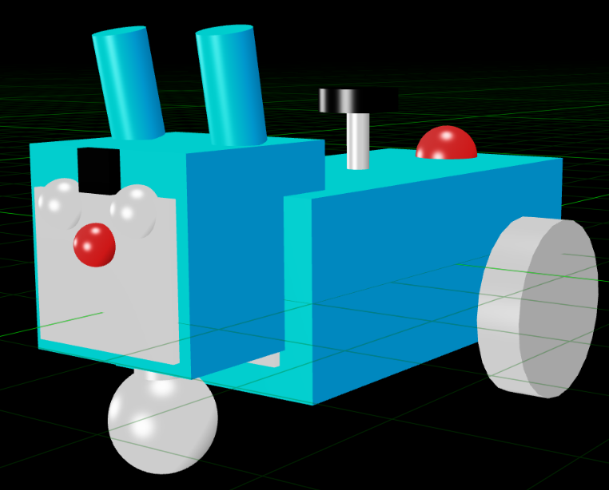
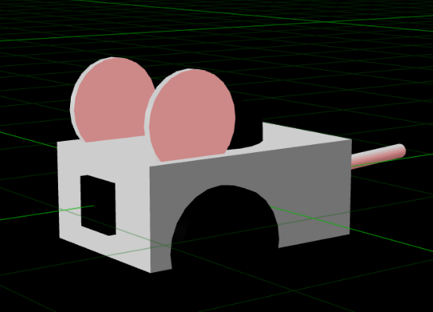

# 🐭 Pac-Mouse: Autonomous Robot Chase Simulation 🐱

[](https://docs.ros.org/en/jazzy/index.html)
[](https://www.python.org/)
[](https://gazebosim.org/)
[](https://opensource.org/licenses/Apache-2.0)

A sophisticated autonomous robotics simulation implementing a Pac-Man-inspired chase game using ROS 2, where an intelligent mouse navigates a maze to collect cheese while evading a predatory cat with advanced AI behaviors.

  
*Doraemon Cat - The Hunter*

  
*Pac-Mouse - The Explorer*

---

## 📋 Table of Contents

- [Overview](#overview)
- [Features](#features)
- [System Architecture](#system-architecture)
- [Technical Stack](#technical-stack)
- [Installation](#installation)
- [Usage](#usage)
- [Robot Controllers](#robot-controllers)
- [Game Mechanics](#game-mechanics)
- [Configuration](#configuration)
- [Project Structure](#project-structure)
- [Troubleshooting](#troubleshooting)
- [Development Team](#development-team)
- [Contributing](#contributing)
- [License](#license)

---

## 🎯 Overview

**Pac-Mouse** is an advanced robotics project developed for the ARI3215 Robotics 2 course. The simulation features two autonomous agents operating in a Gazebo environment:

- **🐭 Pac-Mouse**: An intelligent mouse robot that explores the environment, collects cheese pieces, and uses strategic navigation to avoid capture
- **🐱 Doraemon Cat**: A predator robot with sophisticated AI that hunts the mouse using sensor fusion, predictive pursuit, and dynamic obstacle avoidance

The project demonstrates key robotics concepts including:
- Multi-agent systems
- Autonomous navigation
- SLAM (Simultaneous Localization and Mapping)
- Sensor fusion (LiDAR, Camera, Odometry)
- Path planning and obstacle avoidance
- State machine-based AI behaviors
- Real-time decision making

---

## ✨ Features

### 🤖 Autonomous Navigation
- **SLAM Integration**: Real-time mapping using SLAM Toolbox
- **Nav2 Stack**: Professional-grade navigation with dynamic path planning
- **Obstacle Avoidance**: Advanced clearance-based steering with LiDAR sensor fusion
- **Stuck Recovery**: Intelligent three-phase recovery (reverse, turn, forward) when trapped

### 🧠 Intelligent Behaviors

#### Mouse AI
- **Exploration Modes**: Basic, smart, and hybrid explorer strategies
- **Cheese Collection**: Goal-oriented navigation to cheese locations
- **Escape Tactics**: Dynamic evasion when cat is detected
- **Frontier Exploration**: Systematic environment discovery

#### Cat AI
- **State Machine**: PATROL → CHASE → INVESTIGATE → ESCAPE
- **Predictive Pursuit**: Anticipates mouse movement for interception
- **Visual Tracking**: Camera-based mouse detection with LiDAR validation
- **Power Mode**: Reverses behavior when mouse collects 4 cheese pieces
- **Wall-Aware Vision**: Prevents camera phasing through walls

### 🎮 Game Mechanics
- **Cheese System**: Collectible objectives that trigger power mode
- **Dynamic Roles**: Cat becomes prey after 4 cheese collected
- **Real-time Scoring**: Track performance and game statistics
- **Multiple Controllers**: Teleop, autonomous, and hybrid control modes

### 📊 Visualization
- **RViz2 Integration**: Real-time robot state and sensor visualization
- **TF Tree Visualization**: Complete transform tree display
- **Map Updates**: Live SLAM map construction
- **Sensor Overlays**: LiDAR scans, camera feeds, and odometry paths

---

## 🏗️ System Architecture

### Multi-Agent System Design

```
┌─────────────────────────────────────────────────────────────┐
│                    GAME MASTER NODE                          │
│  • Game State Management                                     │
│  • Cheese Spawn/Collection Logic                             │
│  • Score Tracking                                             │
│  • Win/Loss Conditions                                        │
└─────────────────────────────────────────────────────────────┘
                              │
                ┌─────────────┴─────────────┐
                │                           │
┌───────────────▼──────────────┐ ┌─────────▼──────────────────┐
│      MOUSE ROBOT STACK       │ │      CAT ROBOT STACK       │
├──────────────────────────────┤ ├────────────────────────────┤
│ Controllers:                 │ │ Controller:                │
│  • explorer.py               │ │  • cat_brain.py            │
│  • explorer_mouse.py         │ │                            │
│  • smart_mouse.py            │ │ State Machine:             │
│  • hybrid_explorer_mouse.py  │ │  • PATROL                  │
│  • mouse_brain.py            │ │  • CHASE                   │
│  • mouse_navigator.py        │ │  • INVESTIGATE             │
│  • teleop.py                 │ │  • ESCAPE                  │
│                              │ │                            │
│ Sensors:                     │ │ Sensors:                   │
│  • LiDAR (360°)             │ │  • LiDAR (360°)           │
│  • Camera                    │ │  • Camera                  │
│  • IMU                       │ │  • IMU                     │
│  • Odometry                  │ │  • Odometry                │
└──────────────────────────────┘ └────────────────────────────┘
                │                            │
                └────────────┬───────────────┘
                             │
            ┌────────────────▼─────────────────┐
            │   GAZEBO SIMULATION ENVIRONMENT   │
            │  • Physics Engine                 │
            │  • Sensor Simulation              │
            │  • World Model                    │
            │  • Collision Detection            │
            └───────────────────────────────────┘
                             │
            ┌────────────────▼─────────────────┐
            │       NAVIGATION STACK            │
            │  • SLAM Toolbox                   │
            │  • Nav2 (Path Planning)           │
            │  • Robot Localization             │
            │  • Costmap Layers                 │
            └───────────────────────────────────┘
```

### Communication Architecture

```
ROS 2 Topics:
  /cat/cmd_vel          → Cat velocity commands
  /mouse/cmd_vel        → Mouse velocity commands
  /cat/odom             → Cat odometry
  /mouse/odom           → Mouse odometry
  /cat/scan             → Cat LiDAR data
  /mouse/scan           → Mouse LiDAR data
  /cat/camera           → Cat camera feed
  /mouse/camera         → Mouse camera feed
  /cheese_eaten         → Cheese collection events
  /game_state           → Game status updates
  /map                  → SLAM-generated map
  /tf                   → Transform tree
```

---

## 🛠️ Technical Stack

### Core Framework
- **ROS 2 Jazzy Jalisco** - Latest ROS 2 LTS distribution
- **Python 3.10+** - Primary programming language
- **Gazebo Harmonic** - Physics simulation and sensor modeling

### Navigation & Mapping
| Component | Purpose |
|-----------|---------|
| **Nav2** | Path planning, behavior trees, recovery behaviors |
| **SLAM Toolbox** | Real-time mapping and localization |
| **Robot Localization** | Multi-sensor odometry fusion (EKF) |
| **TF2** | Coordinate frame transformations |

### Dependencies
```yaml
ROS 2 Packages:
  - rclpy                    # ROS 2 Python client library
  - xacro                    # XML macro processing
  - geometry_msgs            # Pose, Twist, Transform messages
  - sensor_msgs              # LaserScan, Image, IMU messages
  - nav_msgs                 # Odometry, Path, OccupancyGrid
  - nav2_msgs                # Navigation actions and messages
  - visualization_msgs       # RViz markers
  - ros_gz_sim               # Gazebo integration
  - ros_gz_bridge            # ROS-Gazebo communication bridge

Python Libraries:
  - transforms3d             # 3D transformations and quaternions
  - numpy                    # Numerical computations
  - opencv-python            # Image processing
```

### Build System
- **ament_python** - Python package build tool for ROS 2
- **colcon** - Meta build tool for ROS 2 workspaces

---

## 📥 Installation

### Prerequisites

- **Operating System**: Ubuntu 22.04 (Jammy Jellyfish) or Ubuntu 24.04 (Noble Numbat)
- **ROS 2 Jazzy**: [Installation Guide](https://docs.ros.org/en/jazzy/Installation.html)
- **Disk Space**: ~5 GB for dependencies and simulation assets

### Step 1: Install System Dependencies

```bash
# Update package list
sudo apt update

# Install ROS 2 Jazzy packages
sudo apt install -y \
  ros-jazzy-ros-gz-sim \
  ros-jazzy-ros-gz-bridge \
  ros-jazzy-robot-localization \
  ros-jazzy-slam-toolbox \
  ros-jazzy-navigation2 \
  ros-jazzy-nav2-bringup \
  ros-jazzy-xacro \
  ros-jazzy-rviz2

# Install Python dependencies
sudo apt install -y \
  python3-transforms3d \
  python3-opencv \
  python3-numpy

# Install utilities
sudo apt install -y tmux xterm
```

### Step 2: Create ROS 2 Workspace

```bash
# Create workspace directory
mkdir -p ~/ros2_ws/src
cd ~/ros2_ws/src

# Clone the repository
git clone https://github.com/giginu1111/Robotics2_ARI3215.git

# Return to workspace root
cd ~/ros2_ws
```

### Step 3: Build the Package

```bash
# Source ROS 2 environment
source /opt/ros/jazzy/setup.bash

# Build with symlink-install for easier development
colcon build --symlink-install --packages-select pac_mouse_pkg

# Source the workspace
source install/setup.bash
```

### Step 4: Verify Installation

```bash
# Check if package is found
ros2 pkg list | grep pac_mouse_pkg

# List available nodes
ros2 pkg executables pac_mouse_pkg
```

Expected output:
```
pac_mouse_pkg cat_brain
pac_mouse_pkg explorer
pac_mouse_pkg explorer_mouse
pac_mouse_pkg game_master
pac_mouse_pkg hybrid_explorer_mouse
pac_mouse_pkg mouse_brain
pac_mouse_pkg mouse_navigator
pac_mouse_pkg smart_mouse
pac_mouse_pkg smart_mouse_hew
pac_mouse_pkg teleop
```

---

## 🚀 Usage

### Quick Start

#### Launch Full Simulation

```bash
# Terminal 1: Launch Everything
ros2 launch pac_mouse_pkg simulation.launch.py
```


## 🧠 Robot Controllers

### Cat Brain (cat_brain.py)

Advanced predator AI with multi-state behavior system.

#### State Machine

```
┌─────────┐     Mouse     ┌──────────┐     Lost      ┌──────────────┐
│ PATROL  │─────seen─────→│  CHASE   │────visual────→│ INVESTIGATE  │
└─────────┘               └──────────┘               └──────────────┘
     ↑                         │                            │
     │                         │                            │
     └─────────────────────────┴────────────────────────────┘
                          Timeout

                     4 Cheese Collected
                            │
                            ▼
                     ┌──────────┐
                     │  ESCAPE  │
                     └──────────┘
```

#### Features
- **Clearance-Based Steering**: Uses full 360° LiDAR for safe navigation
- **Predictive Pursuit**: Anticipates mouse trajectory for efficient interception
- **Wall-Aware Vision**: Prevents false positives from camera phasing
- **Stuck Recovery**: Three-phase recovery (reverse → turn → forward)
- **Adaptive Speed**: Dynamic velocity based on obstacle proximity

#### Parameters

```python
# Perception
sniff_radius = 1.2          # Detection range without line-of-sight
belief_timeout = 5.0        # Time to remember last mouse position

# Motion Limits
max_lin = 0.6               # Maximum linear velocity (m/s)
max_ang = 1.8               # Maximum angular velocity (rad/s)

# Obstacle Avoidance
avoid_dist = 0.60           # Hard stop distance (m)
slow_dist = 1.0             # Begin deceleration distance (m)
front_window_deg = 45.0     # Forward obstacle detection cone (degrees)

# Behavior Tuning
goal_blend = 0.65           # Chase aggressiveness (0=safe, 1=aggressive)
escape_goal_blend = 0.35    # Escape caution (lower = more evasive)
```

### Mouse Controllers

#### Hybrid Explorer Mouse (hybrid_explorer_mouse.py)

Most advanced mouse controller with multi-strategy approach.

**Strategies:**
1. **Frontier Exploration**: Discovers unknown areas systematically
2. **Goal-Oriented Navigation**: Direct path to cheese locations
3. **Reactive Avoidance**: Real-time obstacle dodging
4. **Escape Behavior**: Evasion when cat is detected
5. **Memory-Based Planning**: Remembers explored areas

**Features:**
- A* pathfinding with dynamic replanning
- Occupancy grid mapping
- Cat detection and avoidance
- Cheese prioritization based on distance and safety
- Adaptive speed control

---

## 🎮 Game Mechanics

### Objectives

#### Mouse Objectives
1. **Collect Cheese**: Navigate to and collect all 4 cheese pieces
2. **Survive**: Avoid being caught by the cat for as long as possible
3. **Activate Power Mode**: Collect all 4 cheese to reverse roles

#### Cat Objectives
1. **Hunt Mouse**: Track and catch the mouse before it collects 4 cheese
2. **Survive Power Mode**: Escape from mouse after it becomes powered

### Cheese System

```python
Cheese Locations: 4 pieces scattered in the maze
Collection Radius: 0.5 meters
Power Mode Trigger: 4 cheese collected
Power Mode Effect: Cat enters ESCAPE state, mouse becomes hunter
```

### Scoring (Implemented in game_master.py)

```python
Points:
  - Cheese Collected: +100 points
  - Time Survived: +1 point/second
  - Mouse Caught: -500 points (mouse) / +1000 points (cat)
  - Power Mode Activated: +500 bonus points
```

### Win Conditions

| Condition | Winner | Requirements |
|-----------|--------|--------------|
| All cheese collected + cat escaped | Mouse | 4 cheese + survive power mode |
| Mouse caught before 4 cheese | Cat | Catch mouse in normal mode |
| Timeout | Mouse | Survive until time limit |

---

## ⚙️ Configuration

### URDF/XACRO Files

Robot descriptions are located in `pac_mouse_pkg/urdf/`:

```bash
urdf/
├── mouse.urdf.xacro        # Mouse robot definition
├── cat.urdf.xacro          # Cat robot definition
```

#### Sensor Configuration

```xml
<!-- LiDAR Sensor -->
<sensor name="lidar" type="ray">
  <range>
    <min>0.12</min>
    <max>10.0</max>
  </range>
  <horizontal>
    <samples>360</samples>
    <min_angle>-3.14159</min_angle>
    <max_angle>3.14159</max_angle>
  </horizontal>
  <update_rate>10</update_rate>
</sensor>

<!-- Camera Sensor -->
<sensor name="camera" type="camera">
  <image>
    <width>640</width>
    <height>480</height>
  </image>
  <update_rate>30</update_rate>
</sensor>
```

### World Files

Custom Gazebo worlds in `pac_mouse_pkg/worlds/`:

```bash
worlds/
├── maze_v3_scaled_1.5.sdf              # Main maze environment
├── maze_v3.sdf
└── maze.sdf
```

### Navigation Configuration

Nav2 parameters in `pac_mouse_pkg/config/`:

```yaml
config/
├── nav2_params.yaml        # Navigation stack parameters
├── slam_params.yaml        # SLAM Toolbox configuration
├── ekf_params.yaml         # Robot localization (EKF)
├── bridge_params.yaml      # Gazebo To ROS2 Bridge
```
---

## 📁 Project Structure

```
Robotics2_ARI3215/
├── pac_mouse_pkg/
│   ├── config/                      # Configuration files
│   │   ├── nav2_params.yaml
│   │   ├── slam_params.yaml
│   │   ├── bridge_params.yaml
│   │   └── ekf_params.yaml
│   ├── launch/                      # Launch files
│   │   ├── simulation.launch.py
│   │   └── maze.launch.py
│   ├── models/                      # Gazebo models
│   │   └── cheese_triangle/
│   ├── pac_mouse_pkg/              # Python source code
│   │   ├── __init__.py
│   │   ├── cat_brain.py            # Cat AI controller
│   │   ├── explorer.py             # Basic explorer
│   │   ├── explorer_mouse.py       # Enhanced explorer
│   │   ├── game_master.py          # Game logic
│   │   ├── hybrid_explorer_mouse.py # Advanced AI
│   │   ├── mouse_brain.py          # Basic mouse AI
│   │   ├── mouse_navigator.py      # Navigation utilities
│   │   ├── smart_mouse.py          # Smart controller
│   │   ├── smart_mouse_hew.py      # Alternative smart controller
│   │   └── teleop.py               # Manual control
│   ├── resource/                    # Package resources
│   │   └── pac_mouse_pkg
│   ├── rviz/                        # RViz configurations
│   │   └── mouse_view.rviz
│   ├── urdf/                        # Robot descriptions
│   │   ├── mouse.urdf.xacro
│   │   └── cat.urdf.xacro
│   ├── worlds/                      # Gazebo worlds
│   │   ├── maze_v3_scaled_1.5.sdf  
│   │   ├── maze_v3.sdf  
│   │   └── maze.sdf  
│   ├── package.xml                  # Package manifest
│   ├── setup.py                     # Python package setup
│   └── setup.cfg                    # Setup configuration
├── Documentation/                   # Project documentation
│   ├── Proposal.pdf
│   └── RoboticsProjectGuidelines.pdf
├── .gitignore                       # Git ignore rules
├── .vscode/                         # VSCode settings
├── dependencies.txt                 # Dependency installation commands
├── frames_2026-01-18_23.03.10.gv   # TF tree visualization
├── frames_2026-01-18_23.03.10.pdf  # TF tree PDF
├── oldcat.xacro                     # Legacy cat URDF
├── oldmouse.urdf.xacro             # Legacy mouse URDF
└── README.md                        
```
---

## 👥 Development Team

This project was developed as part of the **ARI3215 Robotics 2** course.

### Team Members

| Name |
|------|
| **Damian Cutajar** |
| **Matthew Farrugia** |
| **Miguel Baldacchino** |

### Areas for Improvement

- [ ] Implement multi-mouse cooperative behavior
- [ ] Add machine learning-based cat prediction
- [ ] Create procedurally generated mazes
- [ ] Develop web-based visualization dashboard
- [ ] Implement difficulty levels
- [ ] Create tournament mode with scoring leaderboard

---

## 📚 References

- [ROS 2 Documentation](https://docs.ros.org/en/jazzy/index.html)
- [Nav2 Documentation](https://navigation.ros.org/)
- [Gazebo Documentation](https://gazebosim.org/docs)
- [SLAM Toolbox](https://github.com/SteveMacenski/slam_toolbox)
- [Robot Localization](http://docs.ros.org/en/melodic/api/robot_localization/html/index.html)

---

<div align="center">

**Made with ❤️ by the Alpha Team**

*Autonomous Robotics • ROS 2 • Gazebo • SLAM*
</div>
